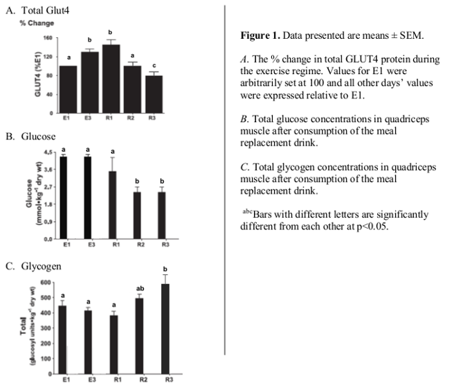

# Tips

* Very similar in structure to midterm
* Take your time, but not too long
* Nearly every included is intentional
* Thought process needs to be clear
    * Can use bullet points, may help
* **Practice using past exams**
* **Use short hand for describe questions**

# Tips

* **Include source of data**
    * (eg. "It was higher (Table 1)/(S1:T1)")
* **Answer the question**
    * (if question says use all data, then use **all** data!)
* Mechanism questions: Include all relevent info/data before
  synthesizing data into a mechanism
      * Example in slides to follow as this was an area that many had
        difficulty with

# Example answer for mechanism question

The question (from 2009 midterm):

> Propose a mechanism to explain how the different diet and endurance
> exercise treatments altered the metabolic parameters presented in
> Table 2. Use only data from Studies 1 and/or 2 to defend your
> answer.

. . .

Key:

* **only** data from S1 + S2
* Diet + exercise + metabolism in table 2

. . .

Let's go back to what S1 + S2 say (will need background too)

# Background

Exercise-induced contractions in skeletal muscle results in increased
delivery of carbohydrate (CHO; glucose) into the muscle to maintain
metabolism.

This is likely through the regulation of glucose transporters (GLUT),
particularly GLUT4, which is the principal isoform in skeletal muscle.

. . .

Key:

* Exercise -> GLUT4 -> CHO into muscles

# S1: T1

# S1: F1

# Wording of results for S1

Take the time to think how to answer it simply and concisely. Combine
results together to be more efficient and cleaner.

. . .

**T1**

* Fasting glucose + glucose AUC: E1 > (R2 = R3) > (E2 = R1)

. . .

**F1**

* GLUT4: R3 < (E1 = R2) < (E3 = R1)
* Muscle glucose + glycogen: (E1 = E2 = R1) > (R2 = R3)

# S2: T2

# S2: F2

# Wording of results for S2

Again, take the time to think how to answer it simply and concisely.

. . .

**T2**

* Fasting glucose + HbA1c: (Base LF = Base HF = Post HF) > Post LF
* TAG + Cholesterol: (Base Lf = Base HF) > (Post LF = Post HF)

. . .

**F2**

* Lipid Oxid. at 60, 90, 120, 150 Watts: (Base LF = Base HF) < (Post
  LF = Post HF)

# Let's go back to the question:

> Propose a mechanism to explain how the different diet and endurance
> exercise treatments altered the metabolic parameters presented in
> Table 2. Use only data from Studies 1 and/or 2 to defend your
> answer.

\vfill

# Answering question --- Start with writing out all relevant data/info

Include the background, S1, and S2 info first thing in the answer!  It
may be redundant, but this is good for you + us!

. . .

> * Background: Exercise -> GLUT4 -> CHO into muscles
> * S1, T1:
    * Exercise reduced fasting glucose + glucose AUC acutely, but
      starting going back to normal after several rests days (E1 > (R2
      = R3) > (E2 = R1))
> * S1, F1:
    * Exercise acutely increased GLUT4, but started dropping right
      after a single rest day (R3 < (E1 = R2) < (E3 = R1))
    * Exercise acutely increased muscle glucose + glycogen, but
      dropped after many rest days ((E1 = E2 = R1) > (R2 = R3))

# Answering question --- Start with writing out all relevant data/info

> * S2, T2:
    * Only LF diet after exercise had lower fasting glucose + HbA1c
      ((Base LF = Base HF = Post HF) > Post LF)
    * Exercise, regardless of diet, reduced TAG + Cholesterol ((Base
      Lf = Base HF) > (Post LF = Post HF))
> * S2, F2:
    * Exercise, regardless of diet, increased lipid oxidation at 60,
      90, 120, 150 Watts ((Base LF = Base HF) < (Post LF = Post HF))

. . .

Then synthesize the answers...

# Answering question --- Now answer the question

> Explain how the different diet and endurance exercise treatments
> altered the metabolic parameters presented in Table 2.

. . .

> * Synthesis:
    * Acute exercise reduces blood glucose (S1:T1), because of the
      increase in GLUT4 (S1:F1; Background), which also lead to an
      increase in intramuscular glucose and glycogen (S1:F1;
      Background).
    * However, if exercise is not consistent enough, these gains are
      diminished (S1:T1 + F1)

# Answering question --- Now answer the question

> * Synthesis, con't
    * The HF diet seems not to influence metabolism much during
      exercise as both groups decreased TAG + cholesterol equally
      (S2:T2) and lipid oxidation was equal between diets (S2:F2)
    * The improvements in glucose + HbA1c in the LF diet in S2:T2 may
      be due to the greater intake of CHO, letting the muscles use
      more glucose
    * But, lipid oxidation is the same between diets, so it could be
      that the LF diet may increase GLUT4 expression to use the
      dietary CHO, reducing blood glucose (as seen in S1:T1) by
      storing it in the muscles (Background)... However, GLUT4 was not
      measured in S2 so this is speculation.

