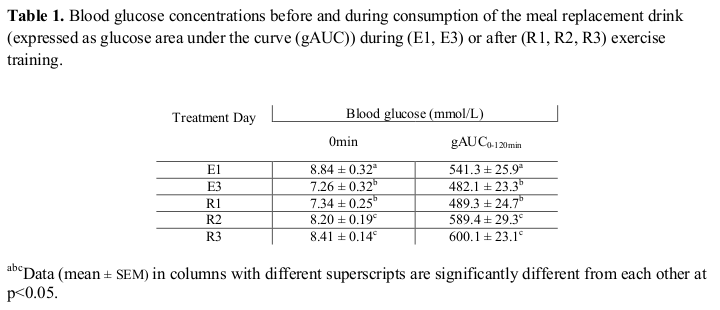
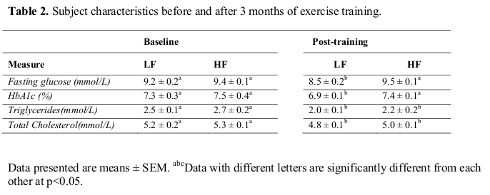

% Practice Midterm
% 2009
% Tutorial 8 <!--"pandoc practiceMidterm.md -t beamer -o practiceMidterm.pdf"-->

# Background

Physical activity (exercise), in general is a major contributor to a
healthy lifestyle.

However, if there is an underlying medical condition, such as Type 2
diabetes, then the benefits of exercise are more significant.

This also applies to the co-morbidities that are often associated with
Type 2 diabetes: obesity, hypertension, and cardiovascular disease,
which are components of the metabolic syndrome.

Current research includes focusing on the role of endurance training
exercise in improving the ability of muscle to utilize different
sources of energy.

# Background, con't

Exercise-induced contractions in skeletal muscle results in increased
delivery of such fuels, including carbohydrate (CHO) in the form of
glucose, into the muscle in order to adequately maintain various
metabolic pathways.

There is speculation that this increased delivery of glucose to the
muscle may be regulated by glucose transporters (GLUT).

GLUT4 is the principal isoform of glucose transporters in skeletal
muscle, and thus the effect of exercise on GLUT4 function is of great
interest.

# Study 1

The purpose of this study was to investigate the responses in
substrate- and energy-based properties to repetitive days of prolonged
low-intensity endurance exercise and recovery.

Twenty Type 2 diabetic subjects (mean age of 50 years old, with BMI
25-29 (overweight)) engaged in endurance training in the morning on
three consecutive days (E1, E2, E3) followed by 3 days of recovery
(R1, R2, R3).

# Study 1, con't

At 2 hours post-training (E1 and E3 only), or at lunchtime on recovery
days, subjects were given a standardized 500mL meal replacement drink
(1000kcal, 40% carbohydrate, 30% protein and 30% fat content), and
blood glucose was measured at 0, 15, 30, 60, and 120min.

The change in blood glucose levels over the 120 minutes was expressed
as glucose area under the curve (gAUC) [Table 1].

Tissue samples were extracted from the quadriceps muscles at 120min
post-drink and were analyzed for changes in total cellular GLUT4
protein expression and muscular concentrations of glucose (this does
not include glucose in the form of glycogen) and glycogen [Figure 1].

# Question 1, Table 1

Describe the effect of the exercise regimen on blood glucose,
GLUT4 protein expression, and muscle concentrations of glucose and
glycogen in Table 1 and Figure 1. (Value 5/50)

# 

# Question 2

Using the information provided in this examination, discuss how
exercise influences the glucose pool (blood glucose versus glycogen)
used for glucose oxidation and its potential impact on glycogen
reserves 1) during exercise training and 2) during the post-training
periods. (Value 7/50 )

# Question 3

Two friends of similar age, weight and physical condition have decided
to join the Nutritional Sciences Graduate Student’s Association’s new
jogging club, as a way to train for the next GSU volleyball match in 6
weeks.

Their schedule consists of a light to moderate jog 3 times a week.

Mr. Smithers stays with the schedule for 6 weeks, while Mr. Burns
decides to quit after 2 weeks.

At the time of the volleyball game, Mr. Burns does not play and
watches from the stands, while Mr.  Smithers plays.

# Question 3, con't

If both men consume the meal replacement drink used in this study, at
the end of the game, what do you expect their blood glucose response
to be and how would this be reflected in muscle glucose and glycogen
levels.

(Assume that the response to exercise is similar in both healthy
adults and those with type 2 diabetes. Remember to not introduce data
/ ideas from outside sources.)  (Value 8/50)

# Study 2 Background

Abnormal lipid utilization, including availability and oxidation, is
prevalent in diabetes, obesity, hyperlipidemia, and the metabolic
syndrome.

Diet-induced weight loss has been shown to improve markers of lipid
metabolism, however, the effect of endurance exercise training on
improving lipid oxidation is not known.

Thus the effect of exercise on lipid oxidation is of great interest.

# Study 2

The purpose of this study was to examine the effect of a 3-month
low-intensity endurance training intervention on markers of glucose
and lipid metabolism, as well as lipid oxidation in adults with type 2
diabetes (n=65, mean age of 50 years, overweight weight with BMI
25-29) while on a low fat (LF) diet or an isocaloric high fat (HF)
diet (energy for both diets: 2000 kcal and was not associated with
weight loss).

# Study 2, con't

Baseline data was collected, and then subjects were randomized to
either the LF or HF diet before beginning their 3-month exercise
regimen (LF baseline and HF baseline data).

At the end of the 3 months, glucose and lipid data were collected
[Table 2].

Also, maximal lipid oxidation was calculated as subjects exercised
under increasing workloads of 30, 60, 90, 120, and 150 Watts at the
end of the 3 months [Figure 2].

# Question 4, Table 2

Describe the effect of the diet and 3-month endurance training regimen
on the metabolic parameters [Table 2] and the intervention’s impact on
lipid oxidation at the end of the exercise training regimen
[Figure 2]. (Value 5/50)

# Figure 2

# Question 5

In one or two sentences, state the key points of Table 2 and Figure 2,
and their integration. (Value 5/50)

# Question 6

Propose a mechanism to explain how the different diet and endurance
exercise treatments altered the metabolic parameters presented in
Table 2. Use only data from Studies 1 and/or 2 to defend your
answer. (Value 8/50)

# Question 7

Suppose you are the new nutritional counselor at Jacques Huot
Elementary School. The Ministry of Education is about to implement a
province-wide physical activity program modeled after the “Take 5”
program from the U.S. Ontario’s version would be 15 minutes of cycling
on stationary bikes 4 times a day for a total of 60min (equivalent to
low-intensity endurance exercise) as a means to combat both childhood
obesity and insulin resistance/type 2 diabetes risk. Based on the data
from lectures and this midterm examination, do you believe that
Ontario’s “Take 15” program is enough? Please justify your
answer. (Value 12/50)
