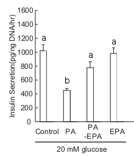

% Midterm Review
% Answers and Mark Distribution
% Tutorial 9

# Table 1 --- p-value

<!-- Discuss that if they have a problem with the mark as a whole to -->
<!-- talk to Carol.  If there is something specific about a question, -->
<!-- talk to me.  Then discuss the p-value thingy -->

\begin{table}[htbp]
\scriptsize{
\begin{tabular}{lrrrrrr}
\hline
Group & \multicolumn{2}{c}{Control} & & \multicolumn{2}{c}{EPA} & \\ \hline
 & Before & After & P1 & Before & After & P2 \\ \hline
FPG (mg/dL) & 104.5 (24.5) & 103.6 (29.5) & 0.62 & 105 (40) & 94.5 (27.4) & $<$ 0.01 \\
C-pep (ug/dL) & 1.5 (1.1) & 1.7 (1.1) & 0.17 & 1.1 (1.1) & 1.5 (1.1) & 0.05 \\
HbA1c (\%) & 6.7 (1.1) & 6.7 (0.7) & 0.16 & 6.6 (0.7) & 6.0 (0.9) & $<$ 0.01 \\ \hline
\end{tabular}
}
\caption{Randomized controlled trial of EPA and control groups.
Columns represent values as means and the standard errors in brackets
at baseline (before) and after intervention.  FPG = fasting plasma
glucose, HbA1c = hemoglobin A1c, C-pep = C-peptide.  P1 reflects
comparisons within the control group and P2 reflects comparisons
within the EPA group.  Significance is denoted at P$<$0.05.}

\end{table}

# Question 1

Describe the results from Table 1. (2/40 marks)

* Control: FPG, HbA1c, C-pep before=after
* EPA: FPG, HbA1c before > after; C-pep before < after (or before=after)
* Marks off if between group comparison was made (there was no tests
  for between group), if no direction was indicated, if
  non-significant findings were not mentioned, or if other variables
  were not mentioned
* Average: 1.98/2

# Question 2

Based on the data in Table 1, taken under fasting conditions, discuss
a potential mechanism whereby EPA may decrease the risk of T2DM. (4/40
marks)

* Many possible answers, but marks were given at most to some mention
  of T2DM risk, relating to glucose control, arguing that insulin
  secretion was involved (or not involved) using C-pep, and
  potentially arguing that there was a problem with the pancreas (or
  with IR)
* Average: 3.05/4

# Question 2, con't

Potential answers include:

* EPA decreases FPG and HbA1c, increases (or no change) C-peptide
  (Table 1).
* The data suggests that EPA increases (or doesn't) the ability of the
  pancreas to release insulin (C-pep) and control fasting blood
  glucose (FPG), inducing long term improvements in glycemic control
  (HbA1c).
* Better blood glucose control = lower risk for T2DM.
* Or: May be insulin resistance because of no C-pep change, may be
  affecting GLUT4 translocation or insulin receptor
* Or: Competes with SFA to inhibit the effect of increased fat
  deposition in the cytosol (Background)
* Or: EPA increases membrane fluidity in the beta-cell for better
  entry of glucose (or in the muscle cells)

# Question 3

Describe the results in Table 2. (2/40 marks)

* Control: gAUC, iAUC, ISI before = after
* EPA: ISI before = after, gAUC before > after, iAUC before < after
* Marks off as described in Q1.
* Average: 1.96/2

# Question 4

What was the value of adding a glucose load, compared to just using
fasting measures, to this experiment?  What additional information
does the glucose/insulin response to the glucose load provide, in
terms of mechanisms, as it relates to the impact of EPA on T2DM risk?
(7/40 marks)

* Marks were given for comparing fed vs fasted conditions (glucose
  load vs fasting), stating that peripheral insulin sensitivity was
  **not** involved and that EPA has a role in insulin secretion, and
  lastly relating that to T2DM risk
* Average: 4.96/7

# Question 4, con't

Potential answer:

* Glucose load provides information on insulin sensitivity
  (i.e. muscle) and on GSIS (pancreas), while fasting does not
* Given increased iAUC, lower gAUC, and no change in ISI (Table 2),
  EPA influences GSIS (potentially via lower cytosolic fat deposition,
  problems with glucose entry into glyocolysis, or with ATP buildup
  (Background)) but does not influence insulin sensitivity

# Question 5

Describe the results presented in Figure 1. (2/40 marks)

* Insulin secretion: Control = EPA = PA-EPA > PA
* Marks off as per Q1.
* Average: 1.99/2

# Question 6

Describe the results shown in Figure 2. (3/40 marks)

* TG, SREBP1c, UCP-2: Control = EPA = PA-EPA < PA
* Marks off as per Q1.
* Average: 2.98/3

# Question 7

Using information from the background and Study 2, propose
mechanism(s) on how PA and EPA may contribute to the regulation of
insulin secretion within the mitochondria and the cytosol. (6/40
marks)

* Marks were given based on clear separation of mitochondria and
  cytosol, which were linked to UCP and SREBP/TG, how these individual
  molecules contributed to GSIS, using the information in the
  background, and that the PA-EPA finding was discussed, stating that
  EPA alone does **not** contribute to GSIS, but inhibits/competes
  with PA (which does affect GSIS)
* Average: 4.21/6

# Question 7, con't

Potential answer:

* PA increased TG, SREBP, UCP, decreased insulin secretion (Figures 1
  and 2).  Addition of EPA attentuated the levels to normal, but EPA
  alone had no effect
* PA increased lipogenesis, which increased TG content, which affects
  cytosolic metabolism (Background), potentially impair glucose entry
  into the beta cell or its passage through glycolysis to create ATP
  (Background), which would reduce GSIS and increase the risk for T2DM
* PA increased UCP, which disrupts production of ATP and preventing
  the accumulation of ATP, which is needed for the depolarization of
  the beta cell membrane in order to release insulin (Background),
  therefore reducing GSIS and increasing the risk for T2DM
* EPA alone has no influence on GSIS, but inhibits the action of PA

# Question 8

Given the data in Study 2, give 3 examples of additional
factors/measures the investigators could have considered in Study 1 to
get a better understanding of the role of n-3 FA in T2DM risk.
Provide a one or two sentence justification for each of these
factors/measures.  (6/40 marks)

* Could have many different types of answers.
* Marks were taken off if more than 3 examples were given, if the
  measure or the location of the measure was ambigious, if the measure
  was entirely unrealistic in humans, if there was more than 2
  sentences, and if the exact same measures as in Study 2 were
  suggested (we aren't looking for regurgitation)
* Average: 3.33/6

# Question 8, con't

Potential (brief) answers:

* Exercise
* Diet
* Serum fatty acids
* C-pep during the glucose load
* Use a control diet
* Include a PA group
* Measure serum PA
* Do comparisons between groups
* Measure markers of lipogenesis (e.g. fatty acid synthase) in serum
* Include a EPA only diet
* Measure lipoproteins

# Question 9

Think back to the course assignment regarding the Sandy Lake
population, where some individuals had a single nucleotide
polymorphism (SNP) at amino acid 319 (G$\rightarrow$S) in the *HNF1A*
gene which caused a decrease in pancreatic insulin production.  Given
the increasing consumption of Western style foods that are high in SFA
in Sandy Lake, discuss 1) how the increase in SFA intake could
contribute to T2DM risk and 2) whether the return to a traditional
diet, including increased consumption of fatty fish (which are high in
EPA), would impact the risk for T2DM.  Be certain to compare and
contrast the impact of dietary fat in both the GG (wild type) and SS
(homozygote for the SNP) groups
\[you do not need to consider the GS heterzygote group in your answer\].
Defend your answer by drawing on data provided in this exam. (8/40
marks)

# Question 9, con't

* Marks were given for distinguishing between insulin production
  (genotype) and insulin secretion (diet/FA type), contrasting the
  different impacts of the SFA vs EPA on the two genotypes (GG vs SS),
  distinguishing between the fact that EPA alone does not contribute
  to reducing risk for T2DM, but that it inhibits effect of SFA, and
  any additional pieces that may have come from the assignment or from
  general knowledge
* Average: 5.19/8

# Question 9, con't

Potential (brief) answer:

* SS have reduced insulin production compared to GG and higher risk
  for T2DM (regardless of environment), and in fact all SS individuals
  got diabetes (Assignment)
* SFA reduce insulin secretion (Study 1 and 2) and thus an increased
  risk of T2DM
* Dietary SFA would increase risk of T2DM in both GG and SS, but more
  so in the SS group because of defect in insulin production AND
  reduced insulin secretion because of SFA
* Returning to a traditional diet (with EPA) would reduce the risk of
  developing T2DM in GG and potentially in SS.  However, traditional
  diet would probably only delay the development of T2DM in SS
  individuals as they still have defect in insulin production.
* EPA alone does not improve GSIS, however, it competes/inhibits the
  effect of SFA and will reduce the risk for T2DM.

# Table 2

\begin{table}[htbp]
\scriptsize{
\begin{tabular}{lrrrrrr}
\hline
Group & \multicolumn{2}{c}{Control} &  & \multicolumn{2}{c}{EPA} &  \\ 
\hline
 & Before & After & P1 & Before & After & P2 \\ 
\hline
ISI & 8.7 (1.4) & 8.7 (0.7) & 0.53 & 8.7 (1.7) & 9.1 (1.4) & 0.60 \\ 
gAUC & 412 (56) & 425 (65) & 0.68 & 408 (75) & 350 (55) & < 0.01 \\ 
iAUC & 850 (102) & 900 (114) & 0.85 & 914 (150) & 1050 (96) & < 0.01 \\ 
\hline
\end{tabular}
}
\caption{Randomized controlled trial of EPA and control liquid meals.
Columns represent values as means and the standard errors in brackets
at baseline (before) and after intervention.  ISI = Muscle insulin
sensitivity index, gAUC and iAUC = glucose and insulin
area-under-the-curve.  P1 reflects comparisons within the control
group and P2 reflects comparisons within the EPA group.  Significance
is denoted at P<0.05.}
\end{table}

# Figure 1

# Figure 2

